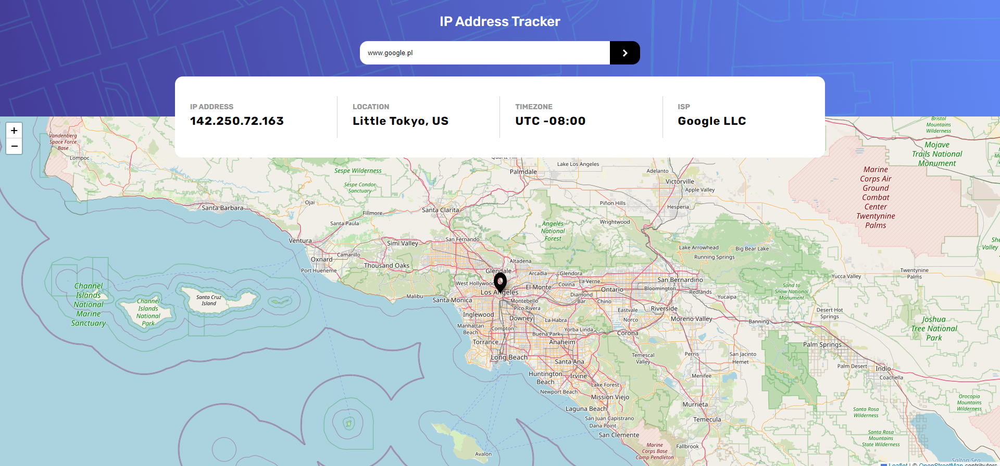
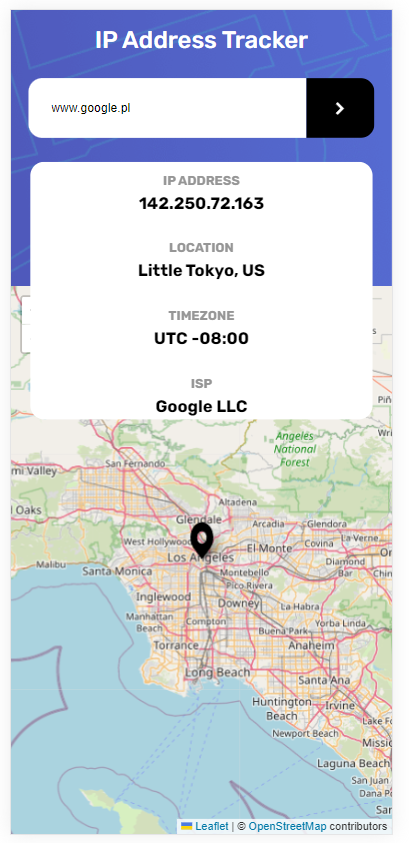

# IP-Address-Tracker

> This project is a front-end challenge aimed at building an IP Address Tracker application to visualize IP addresses' geolocation information. The challenge involves replicating the provided design using HTML, CSS, and JavaScript. The application fetches IP address locations via the IP Geolocation API by IPify and uses LeafletJS for map generation.
> Live demo [_here_](https://lukass9.github.io/IP-Address-Tracker/).

## Table of Contents

- [General Info](#general-information)
- [Technologies Used](#technologies-used)
- [Features](#features)
- [Screenshots](#screenshots)
- [Setup](#setup)
- [Contact](#contact)

## General Information

- Project Overview: The IP Address Tracker is a front-end project aiming to create a web application that visualizes geolocation information based on IP addresses. It provides users with the ability to track and view the geographical locations associated with specific IP addresses or domains.

- Problem Statement: The project intends to address the challenge of easily visualizing and understanding the geographical locations linked to IP addresses. It aims to simplify the process of retrieving and displaying this information in a user-friendly interface.

- Project Purpose: The primary purpose of this project is to demonstrate the practical implementation of HTML, CSS, and JavaScript skills in creating an interactive web application. It showcases the integration of APIs, handling user input, and displaying dynamic content.

- Reason for Undertaking: The project was undertaken as part of a front-end coding challenge provided by Frontend Mentor. The challenge aimed to enhance skills in front-end development by building a realistic application based on provided designs and specifications. Additionally, it offered an opportunity to practice working with APIs and map integration, further expanding expertise in web development.

## Technologies Used

- leaflet - version 1.9.1
- react - version 18.2.0
- react-dom - version 18.2.0
- react-leaflet - version 4.1.0
- styled-components - version 5.3.6

## Features

- Responsive design catering to various device screen sizes
- Interactive elements with hover states
- Displaying user's IP address on initial load
- Searching for and displaying information and location for any IP address or domain

## Screenshots

## Setup and Usage

- Clone the repository
- Install dependencies with `npm install` or `yarn install`
- Run the application locally with `npm start start` or `yarn start start`
- Visit [localhost](http://localhost:3000) in your browser to view the application

## Contact

Created by [@Lukass9](https://github.com/Lukass9) - feel free to contact me!

<!-- Optional -->
<!-- ## License -->
<!-- This project is open source and available under the [... License](). -->

<!-- You don't have to include all sections - just the one's relevant to your project -->
